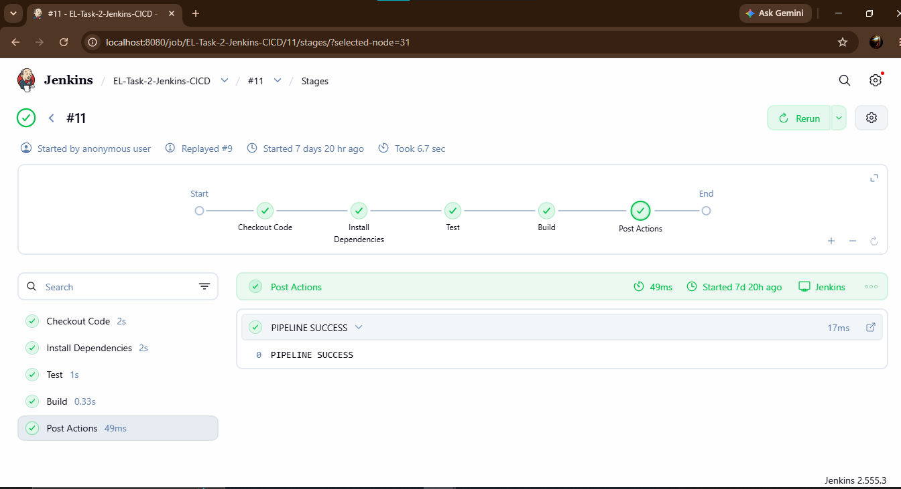
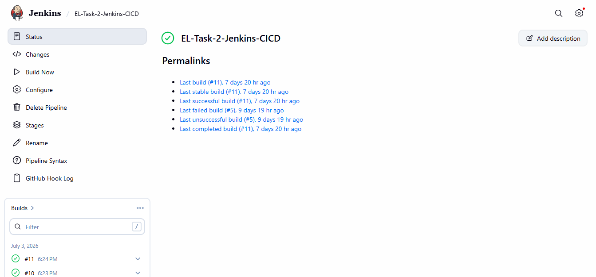
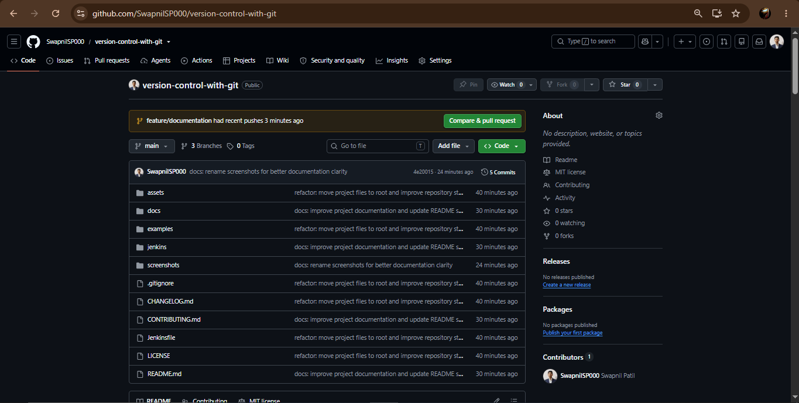
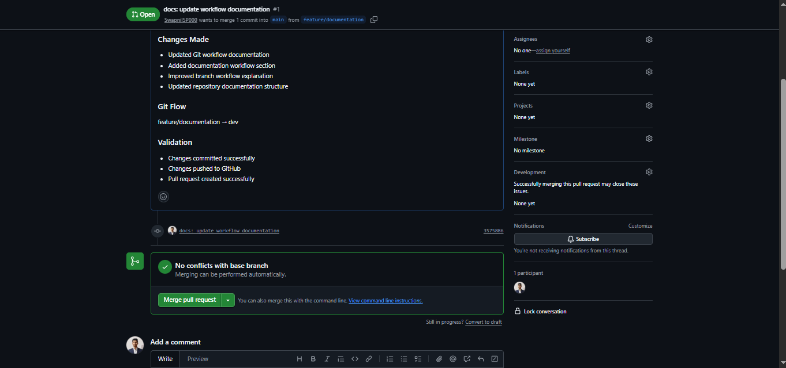
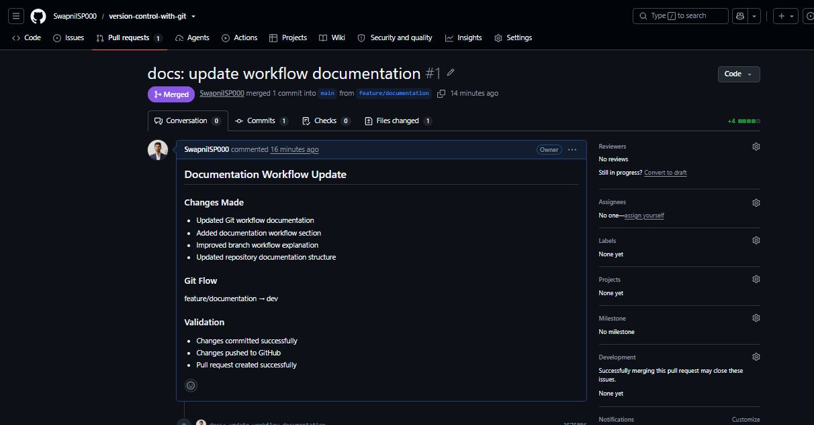

# Version Control With Git

A structured repository implementing Git version control workflows, GitHub collaboration practices, release management, and local Jenkins CI/CD automation.

---

## Project Overview

This repository demonstrates industry-standard version control workflows and CI/CD foundations. In DevOps, version control is the single source of truth; a disciplined Git workflow prevents integration collisions, guarantees software quality, and acts as the trigger for automated delivery pipelines.

### Skills Demonstrated
*   **Git Repository Organization**: Formulating branch workflows and keeping commit histories structured.
*   **GitHub Collaboration**: Operating pull requests, reviewing code changes, and resolving integration conflicts.
*   **Release Management**: Managing version tagging and releases using semantic versioning specifications.
*   **Continuous Integration**: Building multi-stage pipeline triggers using a declarative Jenkinsfile.

---

## Features Demonstrated

*   **Git Branching Strategy**: Separating active development code (`dev`) from stable release code (`main`).
*   **Feature Development Workflow**: Isolated code creation using transient `feature/*` branches.
*   **Pull Requests**: Documenting code modifications and requesting integration checks.
*   **Code Review Process**: Staging pull requests for team reviews and checks before integration.
*   **Merge Workflow**: Utilizing Git merges to consolidate codebase branches cleanly.
*   **Version Tagging**: Generating annotated Git release tags (e.g. `v1.1.0`) to track milestones.
*   **Jenkins CI/CD Basics**: Automating execution stages to verify branch logic.

---

## Tech Stack

*   **Git**: Command-line version control.
*   **GitHub**: Central collaboration platform for managing code reviews, pull requests, and releases.
*   **Jenkins**: Automation server for running local build and test pipelines.
*   **Markdown**: Standard format for technical documentation.
*   **VS Code**: Development environment and workspace editor.

---

## Git Workflow

The integration cycle follows a structured release progression:

```text
Feature Branch
       │
       ▼
Development Branch
       │
       ▼
Pull Request
       │
       ▼
Main Branch
       │
       ▼
Release Tag
```

---

## Jenkins Integration

This repository includes a declarative `Jenkinsfile` configuring local pipeline execution. Jenkins runs locally on `http://localhost:8080` to automate build validation on code updates.

### Pipeline Stages
1.  **Checkout**: Clones and checkouts the source code branch.
2.  **Build**: Compiles software assets or verifies configurations.
3.  **Test**: Executes verification tests to confirm code health.
4.  **Deploy**: Deploys builds into local or staging environments.

---

## Jenkins & GitHub Screenshots

### Jenkins Dashboard


### Pipeline Execution


### GitHub Repository View


### GitHub Pull Request


### GitHub Pull Request Merged


---

## Repository Structure

```text
version-control-with-git/
├── .gitignore
├── CHANGELOG.md
├── CONTRIBUTING.md
├── Jenkinsfile
├── LICENSE
├── README.md
├── assets/
│   └── git-workflow-diagram.png
├── docs/
│   ├── branching-strategy.md
│   ├── git-best-practices.md
│   ├── git-commands.md
│   ├── project-structure.md
│   ├── release-process.md
│   ├── setup.md
│   └── workflow.md
├── examples/
│   ├── cherry-pick-reset-revert.md
│   ├── merge-vs-rebase.md
│   ├── resolving-conflicts.md
│   └── stash-example.md
├── jenkins/
│   ├── ci-cd-workflow.md
│   ├── jenkins-job-setup.md
│   └── jenkins-pipeline.md
└── screenshots/
    ├── README.md
    ├── github-merge-success.png
    ├── github-pull-request.png
    ├── github-repository.png
    ├── jenkins-dashboard.png
    └── jenkins-pipeline-success.png
```

---

## Learning Outcomes

*   **Git Branching**: Mastering branching relationships and branch safety protocols.
*   **Pull Request Workflow**: Designing pull requests that describe changes clearly to reviewers.
*   **Merge Strategy**: Practicing clean merges to keep development logs linear.
*   **Release Tagging**: Applying semantic version tagging to organize release history.
*   **CI/CD Fundamentals**: Mapping code triggers to multi-stage pipeline automations.
