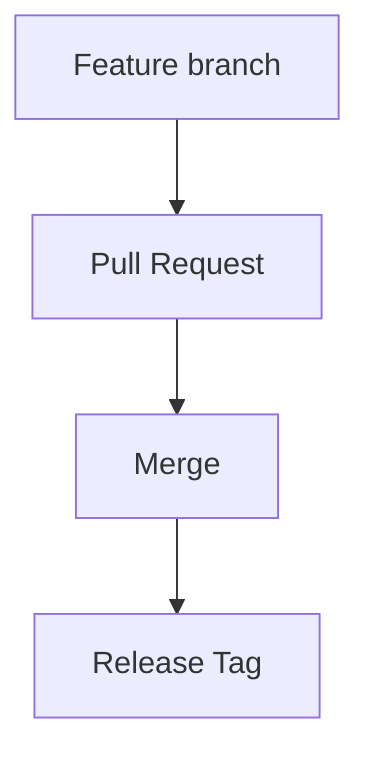
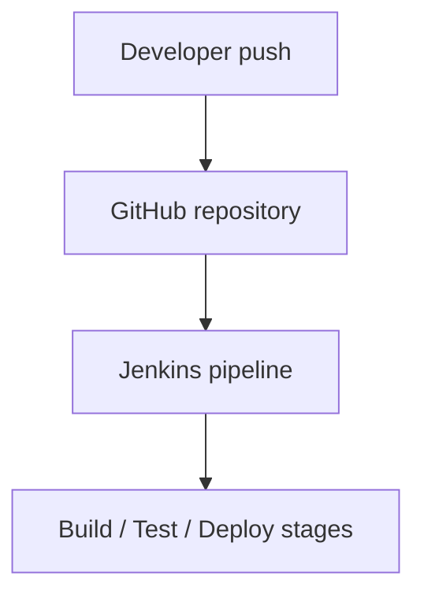

# Project Structure & Workflow Guide

This document describes the directory organization, Git branching model, and local Jenkins CI/CD pipeline integration.

---

## Directory Organization

A structured layout is critical for managing version control assets, examples, documentation, and continuous integration configs. Here is the purpose of each directory in this project:

### `assets/`
*   **Purpose**: Contains diagrams and project visuals, such as the Git workflow diagram (`git-workflow-diagram.png`).
*   **Best Practice**: Keep media files lightweight to avoid repository size bloat.

### `docs/`
*   **Purpose**: Contains technical documentation.
*   **Files**:
    *   [`setup.md`](./setup.md): Environment setup and initial configurations.
    *   [`workflow.md`](./workflow.md): Explanations of feature branches, hotfixes, and release pipelines.
    *   [`branching-strategy.md`](./branching-strategy.md): Visual representations of branch hierarchies.
    *   [`git-best-practices.md`](./git-best-practices.md): Git commit rules, naming conventions, and security policies.
    *   [`git-commands.md`](./git-commands.md): Command reference cheat sheet.
    *   [`release-process.md`](./release-process.md): Instructions for tagging, publishing releases, and versioning.
    *   [`project-structure.md`](./project-structure.md) *(this document)*: Overview of directories and core developer workflows.

### `examples/`
*   **Purpose**: Contains Git command execution examples.
*   **Files**:
    *   [`cherry-pick-reset-revert.md`](../examples/cherry-pick-reset-revert.md): Practical commands for rewriting history and undoing commits.
    *   [`merge-vs-rebase.md`](../examples/merge-vs-rebase.md): Analysis of merge and rebase workflows.
    *   [`resolving-conflicts.md`](../examples/resolving-conflicts.md): Walkthrough of merge conflict resolution.
    *   [`stash-example.md`](../examples/stash-example.md): Stashing code updates temporarily.

### `jenkins/`
*   **Purpose**: Contains Jenkins pipeline information and guides.
*   **Files**:
    *   [`jenkins-pipeline.md`](../jenkins/jenkins-pipeline.md): Guidance on declarative pipeline architecture.
    *   [`jenkins-job-setup.md`](../jenkins/jenkins-job-setup.md): Steps to set up a pipeline job on a local Jenkins instance.
    *   [`ci-cd-workflow.md`](../jenkins/ci-cd-workflow.md): The flow from a local commit to automated execution of tests.

### `screenshots/`
*   **Purpose**: Contains GitHub/Jenkins evidence screenshots.
*   **Files**:
    *   [`README.md`](../screenshots/README.md): Guide describing the purpose of each screenshot.
    *   [`github-repository.png`](../screenshots/github-repository.png): Screenshot of the GitHub repository files view.
    *   [`github-pull-request.png`](../screenshots/github-pull-request.png): Screenshot of the open pull request.
    *   [`github-merge-success.png`](../screenshots/github-merge-success.png): Screenshot of the merged pull request.
    *   [`jenkins-dashboard.png`](../screenshots/jenkins-dashboard.png): Screenshot of the Jenkins project dashboard.
    *   [`jenkins-pipeline-success.png`](../screenshots/jenkins-pipeline-success.png): Screenshot of the successful pipeline run.

---

## Git Workflow Explanation

To guarantee repository health, code integrations flow through controlled gates:

1.  **Feature branch**: Isolated development branch (e.g., `feature/*`) created from the `dev` branch.
2.  **Pull Request**: Code review portal opened on GitHub to stage changes for review.
3.  **Merge**: Code integration into the target branch (`dev` or `main`) after review approval.
4.  **Release Tag**: Generating an annotated Git version tag (e.g., `v1.1.0`) on `main` to identify release milestones.

---

## Jenkins Integration Explanation

Automating build checks ensures that errors are identified before deployments:

1.  **Developer push**: A developer pushes new commits to the GitHub repository.
2.  **GitHub repository**: Serves as the remote hosting platform tracking branch activities.
3.  **Jenkins pipeline**: Triggered automatically (via webhooks) or manually to check the push source code.
4.  **Build / Test / Deploy stages**: Sequential verification steps configured in the `Jenkinsfile` to validate, build, test, and release the software.
