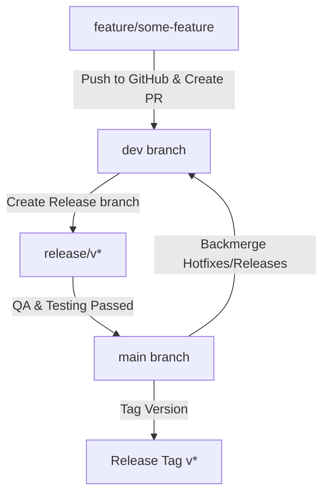
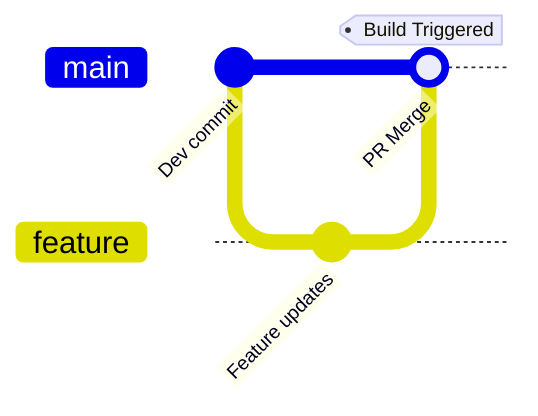

# Project Structure & Workflow Guide

This document details the organization of the repository, the Git branching model, and how the CI/CD pipeline integrates with development stages.

---

## Directory Layout

A structured layout is critical for managing version control assets, examples, documentation, and continuous integration configs. Here is the purpose of each directory in this project:

### 1. `assets/`
*   **Purpose**: Stores diagrams and reference assets used in repository documentation, such as the Git workflow diagram (`git-workflow-diagram.md`).
*   **Best Practice**: Use markdown files for diagrams where possible to prevent binary repository bloat.

### 2. `docs/`
*   **Purpose**: Centralized home for project guides and technical specifications.
*   **Files**:
    *   [`setup.md`](file:///d:/Devops/EL/EL-version-control-with-git/docs/setup.md): Environment setup and initial configurations.
    *   [`workflow.md`](file:///d:/Devops/EL/EL-version-control-with-git/docs/workflow.md): Detailed explanations of feature branches, hotfixes, and release pipelines.
    *   [`branching-strategy.md`](file:///d:/Devops/EL/EL-version-control-with-git/docs/branching-strategy.md): visual representations of branch hierarchies.
    *   [`git-commands.md`](file:///d:/Devops/EL/EL-version-control-with-git/docs/git-commands.md): Command reference cheat sheet.
    *   [`release-process.md`](file:///d:/Devops/EL/EL-version-control-with-git/docs/release-process.md): Instructions for tagging, publishing releases, and versioning.
    *   [`project-structure.md`](file:///d:/Devops/EL/EL-version-control-with-git/docs/project-structure.md) *(this document)*: Overview of directories and core developer workflows.

### 3. `examples/`
*   **Purpose**: Practical demonstrations of complex Git operations.
*   **Files**:
    *   [`merge-vs-rebase.md`](file:///d:/Devops/EL/EL-version-control-with-git/examples/merge-vs-rebase.md): When to preserve history (merge) vs. clean commit trees (rebase).
    *   [`resolving-conflicts.md`](file:///d:/Devops/EL/EL-version-control-with-git/examples/resolving-conflicts.md): Step-by-step walkthrough of resolving merge conflicts.
    *   [`stash-example.md`](file:///d:/Devops/EL/EL-version-control-with-git/examples/stash-example.md): How to save work-in-progress temporarily.
    *   [`cherry-pick-reset-revert.md`](file:///d:/Devops/EL/EL-version-control-with-git/examples/cherry-pick-reset-revert.md): Moving specific commits and undoing history safely.

### 4. `jenkins/`
*   **Purpose**: Contains tutorials and workflows for configuring automated pipelines locally.
*   **Files**:
    *   [`jenkins-pipeline.md`](file:///d:/Devops/EL/EL-version-control-with-git/jenkins/jenkins-pipeline.md): Guidance on declarative pipeline architecture.
    *   [`jenkins-job-setup.md`](file:///d:/Devops/EL/EL-version-control-with-git/jenkins/jenkins-job-setup.md): Steps to set up a pipeline job on a local Jenkins instance.
    *   [`ci-cd-workflow.md`](file:///d:/Devops/EL/EL-version-control-with-git/jenkins/ci-cd-workflow.md): The flow from a local commit to automated execution of tests.

### 5. `screenshots/`
*   **Purpose**: Folder dedicated to screenshot evidence confirming project setup and successful pipeline execution.
*   **Best Practice**: Capture and add real screenshots here according to the naming guidelines detailed in [`screenshots/README.md`](file:///d:/Devops/EL/EL-version-control-with-git/screenshots/README.md) to showcase execution capability to reviewers.

---

## How Git Workflow Works

To guarantee a bug-free production history, code flows through multiple gates:

1.  **Isolation**: Developers branch out of `dev` into dedicated `feature/*` branches.
2.  **Review**: Once the code is ready, a Pull Request is opened against `dev`. This alerts peers to review changes.
3.  **Staging**: Merged feature branches accumulate in `dev`. When a release candidate is selected, a `release/*` branch is spun off for final polishing.
4.  **Production Release**: The release branch is merged into `main` and tagged with standard semantic versioning (e.g., `v1.1.0`).
5.  **Alignment**: `main` is merged back into `dev` to ensure ongoing development inherits production alignments.

---

## Jenkins CI/CD Integration

Automation ensures code changes do not break build processes or configuration standards.

### Pipeline Model

The declarative pipeline configured in [`Jenkinsfile`](file:///d:/Devops/EL/EL-version-control-with-git/Jenkinsfile) triggers on commit activity:

1.  **Code Triggers**: Jenkins monitors the repository.
2.  **Execution Stages**:
    *   **Checkout**: Clone the specific branch source code.
    *   **Build**: Compile resources or package applications.
    *   **Test**: Run validations and unit test assertions.
    *   **Deploy**: Deploy artifacts or deploy to a local environment.
3.  **Feedback**: Build outcome is reported back to the pipeline stage log view (detailed in `jenkins-pipeline-success.png`), ensuring immediate discovery of any code breaks.
